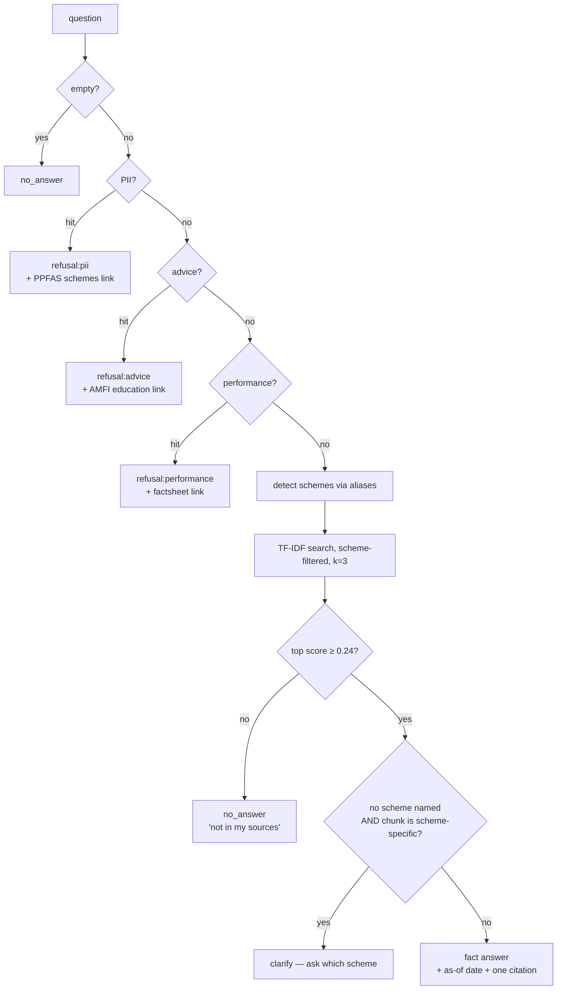

# Architecture — MF Facts Desk

Technical design for the facts-only mutual fund FAQ assistant specified in [`PRD.md`](PRD.md).

| | |
|---|---|
| **Version** | 1.0 |
| **Date** | 30 September 2026 |
| **Implements** | `PRD.md` v1.0 |
| **Scope** | v1 as built (§2–§10) + v2 target design (§11) |

---

## 1. Architectural drivers

The PRD contains one requirement that dominates every design decision:

> **FR-11 — attach exactly one citation link to every answer, refusals included.**

A citation that does not match the answer above it is worse than no answer at all: it
is a wrong figure wearing an official document's authority. Three structural choices
follow from refusing to let that happen.

| Driver | Consequence |
|---|---|
| **A citation must never drift from its answer** | Answers are *stored alongside* their source URL, not generated. There is no paraphrasing step that could change a number while keeping the link. (§4) |
| **Five sibling schemes publish the same facts with different values** | Scheme disambiguation is a *hard filter* executed before scoring, not a similarity signal. Confusing PPFCF with PPTSF is the highest-severity failure available. (§6.3) |
| **Refusing must be cheaper and more reliable than answering** | Guardrails are deterministic patterns evaluated before retrieval, so they cannot be reasoned around or influenced by corpus content. (§7) |

Secondary drivers, from PRD G6 (demoable in class):

- **Zero install** — Python 3.9+ stdlib only. No `pip install`, no API key, no network.
- **Inspectable** — every stage readable in one sitting; nothing hidden behind a framework.

## 2. System context

```
┌─────────────────────────────────────────────────────────────┐
│  Public sources (read once, by hand, at corpus build time)  │
│  PPFAS AMC · monthly factsheet · TER disclosures            │
│  KIM / SID / SAI · Investor Desk · AMFI · SEBI              │
└───────────────────────────┬─────────────────────────────────┘
                            │  manual extraction, 24 sources
                            ▼
                  ┌──────────────────────┐
                  │  corpus/  (JSON+CSV) │   single source of truth
                  └──────────┬───────────┘
                             │
              ┌──────────────┴───────────────┐
              ▼                              ▼
     ┌─────────────────┐            ┌──────────────────┐
     │ Python service  │            │ build_standalone │
     │ app.py + ppfaq  │            │  → dist/index.html│
     └────────┬────────┘            └────────┬─────────┘
              │ HTTP, localhost               │ static file
              ▼                               ▼
       ┌─────────────┐                 ┌─────────────┐
       │ web/index   │                 │ hosted page │
       │ local demo  │                 │ browser-only│
       └─────────────┘                 └─────────────┘
```

**There is no runtime dependency on the internet.** Sources were read during corpus
assembly; at query time the system touches nothing but local files. This is why the
demo cannot fail on classroom wifi, and it is also why figures go stale (§12).

## 3. Component model

```
app.py ──────────────── HTTP transport, JSON API, static file serving
  │
  └─► ppfaq/
        assistant.py ── orchestration: guard → detect → retrieve → shape answer
          │             owns MIN_SCORE, DISCLAIMER, WELCOME, EXAMPLES
          │
          ├─► guards.py ──── PII / advice / performance refusals  (no corpus access)
          ├─► retriever.py ─ tokenizer, TF-IDF index, scheme detection, scoring
          └─► corpus.py ──── loads corpus.json, schemes.json, sources.csv into dataclasses

ppfaq/cli.py ─────────── terminal front end, same Assistant
scripts/ ─────────────── build + verification, never imported at runtime
tests/ ───────────────── 21 tests
```

**Dependency rule:** dependencies point inward, and nothing points back out.
`guards.py` imports nothing from the package — it is pure pattern matching over a
string, which is what makes it trivially testable and impossible to influence from the
corpus. `retriever.py` knows about `corpus.py` types but nothing about HTTP or
refusals. `assistant.py` is the only module that knows the full pipeline.

**Single-definition rule:** user-facing copy (`DISCLAIMER`, `WELCOME`, `EXAMPLES`) and
the relevance floor (`MIN_SCORE`) are declared once in `assistant.py` and *read* by the
API, the CLI, the standalone build and the sample generator. Four surfaces, one
definition — they cannot drift (PRD §6).

## 4. Data architecture

### 4.1 The chunk

`corpus/corpus.json` — an array of 55 records. One record is one fact about one scheme.

```json
{
  "id": "C01",
  "scheme": "PPFCF",
  "topic": "expense_ratio",
  "keywords": "expense ratio ter total expense ratio cost charges fees regular direct plan",
  "answer": "Parag Parikh Flexi Cap Fund's base expense ratio is 1.05% for the Regular Plan and 0.53% for the Direct Plan, as on the last business day of August 2026. …",
  "source_id": "S07",
  "source_title": "PPFAS Monthly Factsheet - August 2026",
  "source_url": "https://amc.ppfas.com/downloads/factsheet/2026/ppfas-mf-factsheet-for-August-2026.pdf",
  "as_on": "August 31, 2026"
}
```

Three fields deserve comment.

**`answer` is the finished, shippable sentence.** It is not source material to be
summarised at query time — it *is* the response. It ships in the same record as
`source_url`, so the pair travels together through retrieval and out to the UI. This
is the mechanism behind driver #1: there is no code path that can emit the answer
without the URL that backs it.

**`keywords` is a retrieval surface, not content.** It is never displayed. It exists so
a user's vocabulary ("charges", "TER", "fees") can reach a chunk whose answer text uses
different words. Widening recall here is cheap and safe; widening it by loosening the
threshold is neither.

**`scheme` is either a scheme code or the sentinel `"ALL"`.** `"ALL"` marks facts that
do not vary by scheme — how to download a statement, what a riskometer means, where the
factsheet archive lives. The distinction drives FR-14 (§6.4): a low-scoring match on a
scheme-specific chunk when no scheme was named is *ambiguity*, while the same on an
`"ALL"` chunk is simply an answer.

**Derived field.** `Chunk.text`, used only for indexing, is
`topic (underscores→spaces) + keywords + answer`. The displayed answer and the indexed
text are deliberately different strings.

### 4.2 The scheme registry

`corpus/schemes.json` — AMC metadata, corpus dates, and the five schemes with their
aliases:

```json
{"code": "PPDAAF", "name": "Parag Parikh Dynamic Asset Allocation Fund",
 "aliases": ["dynamic asset allocation", "ppdaaf", "daaf", "balanced advantage", "dynamic"]}
```

The alias list is the entire scheme-detection vocabulary (§6.3). It is data, not code,
so adding how people actually refer to a fund needs no code change.

### 4.3 The source register

`corpus/sources.csv` — 24 rows: `id, publisher, title, url, doc_type, used_for`.

This is the provenance ledger for PRD §4's source rules, and it is **enforced, not
documented**: `test_every_chunk_source_is_registered` asserts every chunk's `source_id`
resolves to a row here, and `test_chunk_url_matches_registered_source_url` asserts the
chunk's URL equals the registered one. A chunk cannot cite a source that was never
declared, and cannot quietly point somewhere else.

### 4.4 Integrity constraints

| Constraint | Enforced by |
|---|---|
| `chunk.source_id` ∈ `sources.csv` | `test_every_chunk_source_is_registered` |
| `chunk.source_url` == registered URL | `test_chunk_url_matches_registered_source_url` |
| `chunk.id` unique | `test_chunk_ids_unique` |
| `chunk.answer` ≤ 3 sentences | `test_answers_are_at_most_three_sentences` |
| source count within brief | `test_source_count_within_brief` |

The corpus is the system's database, and these are its constraints. They run in CI-time
tests rather than at load time because a violation is an authoring error to be caught
before shipping, not a condition to handle at runtime.

## 5. Request lifecycle



Six terminal states, each carrying a link: `fact`, `clarify`, `no_answer`,
`refusal:pii`, `refusal:advice`, `refusal:performance`.

**Every exit from `Assistant.ask` constructs an `Answer` with a `source_url`.** The
dataclass makes the link non-optional, so the citation contract is enforced by the type
rather than by remembering to add it on each branch — which is what lets
`test_every_answer_has_one_citation` pass across all six states.

## 6. Retrieval design

### 6.1 Why not vectors, in v1

The corpus is 55 chunks and each chunk is already exactly one fact. Semantic
compression buys nothing when there is no long prose to compress. What actually decides
accuracy here is *which scheme* the question is about — and that is a lookup problem,
not a similarity problem. v1 therefore solves the hard part exactly (alias filter) and
the easy part cheaply (lexical scoring within the filtered set).

The trade-off is recall on unfamiliar phrasings (§12), and it is the reason §11 exists.

### 6.2 Tokenisation

`[a-z0-9]+` on lowercased text, then:

1. **Synonym expansion** — a 23-entry map: `ter|er|charges|fee|fees|cost → expense ratio`,
   `redeem|redemption|withdraw → exit load`, `index → benchmark`,
   `started|launch|launched|old → inception`, `cg → capital gains`.
2. **Stopword removal** — standard English stopwords **plus** `fund`, `scheme`,
   `parag`, `parikh`, `ppfas`, `mutual`.
3. Tokens shorter than 2 characters dropped.

Step 2 is the subtle one. Those six words appear in nearly every chunk *and* nearly
every question, so they carry no discriminating information — but left in, they would
add correlated mass to every score and compress the gap between good and bad matches.
Removing the AMC's own name from the index is safe precisely because scheme identity is
handled by a separate exact mechanism (§6.3) rather than by the scorer.

### 6.3 Scheme detection — the hard filter

`detect_schemes()` scans the question for each scheme's name, code and aliases on word
boundaries, records the **character position** of each match, and returns scheme codes
ordered by where they appeared in the question.

Position ordering is what makes *"compare the ELSS lock-in with the flexi cap"* resolve
to PPTSF first and offer PPFCF as the follow-up (FR-15), rather than depending on
dictionary order.

The detected scheme is then applied in `search()` as a **filter**, not a feature:

```python
if scheme is not None and chunk.scheme not in (scheme, "ALL"):
    continue
```

Chunks belonging to other schemes are not scored at all. A named scheme makes
cross-scheme contamination *structurally impossible* rather than merely unlikely — this
is the mechanism behind acceptance criterion A2
(`test_expense_ratio_elss_not_confused_with_flexi`).

### 6.4 Scoring

Both chunk and query vectors use smoothed TF-IDF, L2-normalised:

```
idf(t)  = log((N + 1) / (df(t) + 0.5))          N = 55
w(t)    = (1 + log(tf(t))) · idf(t)
vector  = w / ‖w‖₂
```

so the dot product of two normalised vectors is cosine similarity. Then a bias is added:

| Condition | Adjustment | Purpose |
|---|---|---|
| scheme named, chunk is that scheme | **+0.25** | prefer the specific fact over the generic one |
| scheme named, chunk is `"ALL"` | **+0.05** | keep generic facts reachable |
| no scheme named, chunk is scheme-specific | **−0.10** | surface generic facts first when the question is ambiguous |

Ties break on `chunk.id`, so output is deterministic — a property the parity check
(§9) depends on.

> **The reported `score` is a biased cosine, not a cosine.** It can exceed 1.0 and is
> not comparable across queries with different scheme-detection outcomes. It is a
> ranking quantity compared against one fixed floor, and should not be read as a
> confidence percentage.

### 6.5 Out-of-vocabulary terms — FR-17

Standard TF-IDF assigns an unseen term zero weight, which silently deletes it from the
query. *"What is the capital of France?"* then reduces to `capital`, matches the
capital-gains chunk, and answers confidently.

```python
self._oov_idf = max(self._idf.values(), default=1.0)
vec = {t: (1 + log(c)) * self._idf.get(t, self._oov_idf) for t, c in tf.items()}
```

An unseen term is treated as the **rarest term in the corpus** — the maximum IDF
observed. `france` now takes real mass in the query vector; after normalisation it
dilutes `capital`, the cosine falls below 0.24, and the question routes to "not in my
sources" (A15).

This is the single most important line in the retriever. The default behaviour is not
merely less accurate — it is confidently wrong, in the direction the product most needs
to avoid.

### 6.6 The relevance floor

`MIN_SCORE = 0.24`, in `assistant.py` rather than the retriever: *how similar is this*
is a retrieval question, *is that similar enough to say out loud* is a product one. The
floor is injected into the standalone build so both implementations share the value.

## 7. Guardrail architecture

Three pattern families in `guards.py`, evaluated **in fixed order, before retrieval**.

```
PII  ──►  advice  ──►  performance  ──►  retrieval
```

| Property | Rationale |
|---|---|
| **Deterministic regex, not model judgement** | Behaviour is enumerable and testable; cannot be talked around by rephrasing (GR-6) |
| **Before retrieval** | A refused question never reaches the corpus and never costs a search |
| **PII strictly first** | Nothing else should examine text that may contain personal data |
| **No corpus access** | `guards.py` imports nothing from the package; refusal links are module constants |
| **Refusals carry links** | The citation contract is *every* answer, so refusals cite an educational or scope page |

**Precision matters as much as recall.** The performance family is deliberately narrow:
it matches phrasings that ask the system to *judge or compute* performance
(`beat the benchmark`, `outperformed`, `track record`, `CAGR`), and does **not** match
the bare word *benchmark*. A plain *"what is the benchmark of the flexi cap fund?"* is
a fact (FR-6) and must fall through. Over-blocking it is a defect, not caution — hence
GR-5 and its dedicated test (A7).

### Privacy

- `app.py` overrides `log_message()` to a no-op — **HTTP access logging is disabled**,
  so questions never reach a log file.
- `Cache-Control: no-store` on every response.
- No session, no database, no writes. The question is a function parameter and is
  garbage-collected with the request (FR-18).
- The standalone build makes **no network calls at all** — the corpus is inlined and
  retrieval runs in the browser, so on the hosted page the question never leaves the
  device (FR-19).

## 8. Interfaces

### HTTP (`app.py`, `ThreadingHTTPServer`, stdlib)

| Route | Method | Returns |
|---|---|---|
| `/` | GET | `web/index.html` |
| `/api/meta` | GET | `welcome`, `examples`, `disclaimer`, `schemes`, `corpus_last_updated` |
| `/api/ask` | POST | the serialised `Answer` |

`/api/meta` exists so the UI renders its welcome line, examples and disclaimer from
server-owned constants rather than duplicating them in HTML — the single-definition
rule (§3) reaching the browser.

### The `Answer` contract

```python
text, source_title, source_url, as_on, kind,
scheme, topic, chunk_id, score, followup
```

`kind` ∈ {`fact`, `clarify`, `no_answer`, `refusal:pii`, `refusal:advice`,
`refusal:performance`} — it lets the UI style refusals differently and lets tests assert
on routing rather than on wording. `chunk_id` and `score` make any answer traceable back
to the exact corpus record that produced it.

`Answer.render()` defines the plain-text layout used by the CLI and the generated sample
file: text → follow-up → `Last updated from sources:` → `Source:`.

## 9. The dual implementation

The hosted demo cannot run Python, so `web/standalone.template.html` contains a
JavaScript port of the same tokeniser, TF-IDF, scheme detection and guards.

**Two implementations of the same logic is a correctness risk**, and the architecture
addresses it in two ways.

**One source of truth.** `scripts/build_standalone.py` injects the corpus, the scheme
registry, the UI copy and `MIN_SCORE` into the template at build time by replacing
`/*__MARKER__*/` sentinels, failing the build if a marker is missing. Neither the data
nor the threshold is retyped in JavaScript — only the *algorithm* is duplicated.

**Enforced parity.** `scripts/check_parity.py` runs a fixed **40-question** set through
the Python assistant and writes `scratch/python-answers.json`;
`scripts/check_parity.mjs` runs the same 40 through the JS build and diffs. The set spans
facts, abbreviations, synonyms, ambiguity, all three refusal families and out-of-scope
questions.

```bash
python scripts/check_parity.py && node scripts/check_parity.mjs
```

This is a guard rail, not a proof — it covers 40 questions, not the input space. Any
change to retrieval or guards must be mirrored in both and re-verified.

## 10. Build and verification

Generated artefacts, never hand-edited:

| Artefact | Built by | From |
|---|---|---|
| `dist/index.html` | `scripts/build_standalone.py` | corpus + template + assistant constants |
| `docs/sample-qa.md` | `scripts/make_samples.py` | live assistant output, 12 queries |
| `scratch/python-answers.json` | `scripts/check_parity.py` | live assistant output, 40 queries |

```bash
python scripts/make_samples.py && python scripts/build_standalone.py   # regenerate
python -m unittest discover -s tests -v                                # 21 tests
python scripts/check_parity.py && node scripts/check_parity.mjs        # parity
```

`docs/sample-qa.md` being *generated* matters: the sample Q&A deliverable is a
transcript of real behaviour, so it cannot describe answers the system does not give.

### Test architecture

| Layer | Tests | What it protects |
|---|---|---|
| Fact retrieval | A1–A8 | The eight question types in PRD §5.1 |
| Answer shape | A9, A10 | Citation contract, 3-sentence cap |
| Guardrails | A11–A14 | Three refusal families + "nothing stored" |
| Routing | A15–A17 | Fallback, clarify-don't-guess, NAV/AUM deflection |
| Corpus integrity | A18–A21 | Provenance and uniqueness (§4.4) |

## 11. v2 — embedding pipeline (specified, not built)

PRD §7.2 mandates MiniLM + ChromaDB. The architecture is designed so this replaces
**one component**.

### What changes

```
                      v1                          v2
  index      TF-IDF over Chunk.text      MiniLM 384-dim over Chunk.text
  store      in-memory dict vectors      ChromaDB, persisted to disk
  filter     Python `continue`           Chroma `where={"scheme": …}` clause
  scoring    biased cosine               cosine + same bias, same floor
```

`Retriever` is the seam: `assistant.py` depends only on `detect_schemes()` and
`search() -> List[Hit]`. A `VectorRetriever` satisfying that interface drops in without
touching orchestration, guards, the `Answer` contract or the UI.

### What does not change

- **Guards stay ahead of retrieval and stay deterministic** (TR-5). Embeddings must not
  be given the chance to decide whether something is advice.
- **Answers stay stored, not generated** (§4.1). v2 changes *how a chunk is found*, not
  *what is said once it is found* — so FR-11 holds by the same mechanism.
- **The corpus files stay the source of truth.** Ingestion reads the same
  `corpus.json`; ChromaDB becomes a derived index, rebuildable and disposable.
- **Scheme filtering stays a hard filter** (§6.3), now pushed into the vector store's
  metadata clause. MiniLM would not reliably separate two chunks differing only in a
  proper noun, so this becomes *more* important under v2, not less.

### New concerns v2 introduces

| Concern | Mitigation |
|---|---|
| `MIN_SCORE = 0.24` is calibrated to biased TF-IDF and will not transfer | Re-calibrate against the 40-question parity set; off-topic questions must still fall below |
| FR-17's max-IDF trick has no embedding equivalent — dense models return a plausible neighbour for *any* input | The re-calibrated floor becomes the **only** out-of-scope defence. Add explicit negative tests |
| Zero-install and offline-demo properties are lost (torch, chromadb, ~90 MB model) | Keep v1 as the demo path; v2 behind its own entry point |
| Chroma persistence can drift from an edited corpus | Ingestion writes a corpus hash; mismatch forces a rebuild |
| The JS port cannot run MiniLM | The hosted page stays on v1. Parity becomes v1↔v1 only; document the divergence |

**Acceptance (PRD §7.2):** v2 must answer all 40 parity questions identically on facts,
with no new advice or performance leakage.

## 12. Known architectural limits

- **Staleness is structural.** There is no scraper by design — every number was read
  from a document by hand so it could be traced. The cost is manual refresh: update
  `corpus.json` and bump `corpus_last_updated`. Mitigated, not solved, by `as_on` on
  every answer.
- **Lexical retrieval has no synonym knowledge beyond the 23-entry map.** A genuinely
  novel phrasing falls to the fallback. Intended failure mode; real recall cost.
- **Scheme detection is exact-match.** A misspelling ("flexicap" is mapped, "flexi-kap"
  is not) fails to detect, dropping the question into the clarify path. Acceptable —
  asking is safe, guessing is not.
- **Two implementations.** Guarded across 40 questions, not proven equivalent (§9).
- **The `score` field is not a confidence.** See §6.4.
- **Dead branch.** `retriever.py:132-134` is a `pass` with an explanatory comment — the
  no-scheme case is handled by the `−0.10` penalty at line 141. Harmless, but it reads
  as unfinished; worth deleting.
- **`_oov_idf` is the max IDF, so it scales with corpus size.** At 55 chunks it is well
  behaved. If the corpus grows substantially, re-verify that A15 still fails closed.

## 13. Requirements traceability

| PRD | Requirement | Realised in |
|---|---|---|
| FR-1…FR-8 | Fact answers | `corpus/corpus.json` — 55 chunks across 22 topics |
| FR-9 | NAV/AUM → factsheet | Corpus chunks `nav`, `aum` deflect by content |
| FR-10 | ≤ 3 sentences | Authored into `answer`; `test_answers_are_at_most_three_sentences` |
| FR-11 | Exactly one citation | `Answer.source_url` non-optional on all six exit paths (§5) |
| FR-12 | As-of date | `Chunk.as_on` → `Answer.as_on` → `render()` |
| FR-13 | Scheme detection + hard filter | `Retriever.detect_schemes`, filter in `search` (§6.3) |
| FR-14 | Ask, don't guess | `assistant.py:106` — `not detected and chunk.scheme != "ALL"` |
| FR-15 | Multi-scheme follow-up | `assistant.py:120` — position-ordered detection |
| FR-16 | Relevance floor | `MIN_SCORE = 0.24` (§6.6) |
| FR-17 | OOV = rarest term | `Retriever._oov_idf` (§6.5) |
| FR-18 | No logging or persistence | `log_message` no-op, `no-store`, no writes (§7) |
| FR-19 | Hosted page makes no network calls | Corpus inlined by `build_standalone.py` (§9) |
| GR-1…GR-3 | PII / advice / performance | `guards.py` — ordered pattern families (§7) |
| GR-4 | "Nothing stored" in PII refusal | `guards.py` PII message |
| GR-5 | Benchmark is a fact | Narrow performance patterns (§7) |
| GR-6 | Non-negotiable guards | Deterministic regex, pre-retrieval |
| §6 | UI spec | `WELCOME`/`EXAMPLES`/`DISCLAIMER` → `/api/meta` → both UIs (§3) |
| §7.2 | v2 pipeline | §11 |
| §8 | Acceptance | `tests/` (§10) + `scripts/check_parity.*` (§9) |
